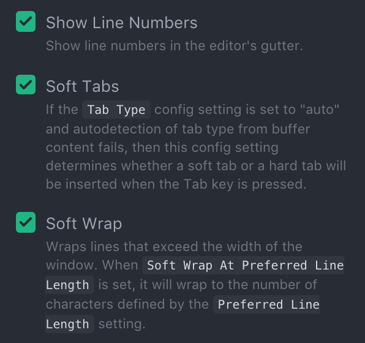

## ATOM MANUAL
### Prepare
> It's an open source text editor.  
Available under the https://github.com/atom organization.

* Download from https://github.com/atom.

### Start
* Basic terminology  
 * Buffer 缓冲区
 表示Atom中一个文件的文本内容；被保存后其内容才会被写入硬盘里
 * Pane 窗格  
 表示Atom中一个可见区域  
 * Keybinding 快捷键  
 A keybinding is the mapping of a key combination, such as   `Ctrl+Enter` to an Atom command.  
* Command palette  
If you press `Cmd+Shift+p` while focused in an editor pane, the command palette will pop up.  
* Settings and preferences
press `Cmd+,` keybinding  
 * Changing the theme
 * Soft wrap
 * Soft tabs

 > 

* Opening, modifying and saving files  
 * Opening a file  
 press `Cmd+o`  
 > `Cmd+o` is useful for opening a file that is not contained in the project you're currently in (more on that next), or if you're starting from a new window for some reason.

 * Editing and saving a file  
 press `Cmd+s` => save the file   
 press `Cmd+Shift+s` => save the current content under a different file name    
 press `Alt+Cmd+s` => save all the open files  

* Opening directions  
press `Cmd+Shift+o`  
> When you open Atom with one or more directories, you will automatically get a [Tree View](https://github.com/atom/tree-view) on the side of your window.  
>> You can also hide and show it with `Cmd+\` , and `Ctrl+0` will focus it. When the Tree view has focus you can press `A`, `M`, or `Delete` to add, move or delete files and folders. You can also right-click on a file or folder in the Tree view to see many of the various options, including all of these plus showing the file in Finder or copying the file path to your the clipboard.  

 * Opening a file in a project  
   * press `Cmd+t` or `Cmd+p`, the Fuzzy Finder will pop up  
   * press `Cmd+b` => search through only the files currently opened (rather than every file in your project)  
   * press `Cmd+Shift+b` => search only through the files which are new or have been modified since your last Git commit  

### Shortcut keybindings and packages    
> [Using atom (keybindings)](http://flight-manual.atom.io/using-atom/#using-atom)  
[简书 入门 快捷键](http://www.jianshu.com/p/aa8f8a252ed9)  
https://github.com/futantan/atom/blob/master/README.md  
[极客学院](http://wiki.jikexueyuan.com/project/atom/)  
[Atom.io (packages)](https://atom.io/packages)     

#### Recommendation  
 * Themes  
 [atom-material-ui](https://atom.io/themes/atom-material-ui)  
 [atom-material-syntax](https://atom.io/themes/atom-material-syntax)  
 * Packages  
 [atom-beautify](https://atom.io/packages/atom-beautify)  
 [file-icons](https://atom.io/packages/file-icons)  
 [emmet](https://atom.io/packages/emmet)  
 [color-picker](https://atom.io/packages/color-picker)  
 [pigments](https://atom.io/packages/pigments)  
 [atom-ternjs](https://atom.io/packages/atom-ternjs)  
