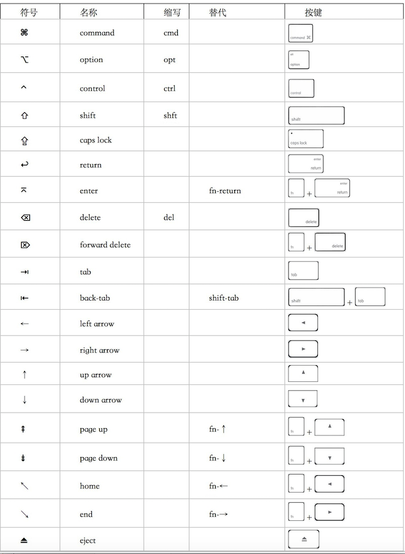

## Shortcut Keys
* 符号与部分按键对照表  
   
* 快捷键功能   
 Command A ：全选  
Command C ：拷贝  
Command V ：粘贴  
Command X ：文字剪切（不支持文件剪切）  
**Command ，：偏好设置**  
Command W ：关闭当前窗口  
Command Q ：关闭当前程序  
Command Shift Q ：退出所有程序并注销  
Command Option esc ：强制退出应用程序，类似于win下的任务管理器  
Command N ：新建当前程序的文件  
Command S ：保存  
Command H ：隐藏当前程序（Boss Key）  
Command Option H ：隐藏所有后台程序  
Command P ：打印  
Command Shift P ：页面设置  
Command tab ：切换到下一个应用程序  
Command Shift tab ：切换到上一个应用程序  
**Command ~ ：在同一程序的不同窗口下切换，safari上网经常用**  
Command M ：最小化当前窗口  
**Command Option F ：有搜索栏的程序跳到搜索栏，如Preview(预览)的搜索栏，Safari的Google栏**  
* 手势
 * 手势设置  
  在系统偏好设置里的触摸板里自行设置  
  
 * 个人偏好  
  三指轻拍：选择文字＋查找  
 两指：拖动页面＋轻拍右键    
 四个手指向上轻扫：Mission Control    
 捏拢拇指和其他三个手指：Launchpad   
 ...
