## MARKDOWN EDITOR - ATOM (For Mac)
### Why we use atom
> Our goal is a zero-compromise combination of hackability and
usability: an editor that will be welcoming to an elementary school
student on their first day learning to code, but also a tool
they won't outgrow as they develop into seasoned hackers.
>> For myself, i regard it as a fantastic tool for coding,
editing and reading. By the way, it's cool and useful.  
Click [here](http://flight-manual.atom.io) to know about it.  

### How we start
* 打开atom，新建一个file，保存为 `.md` 格式
* 按快捷键 `command+shift+P` ，在弹出框中 `markdown` ，选择 `Markdown Preview: Toggle` 或者直接按 `control+shift+m` 即可在编辑区右边看见渲染效果，
如下图所示：  
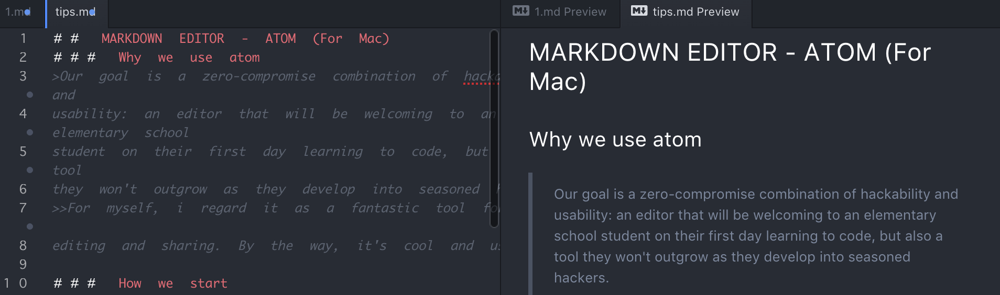
* 接下来你就可以随意地编辑啦

### Let's start
#### Title
推荐使用类atx形式：在行首插入1到6个 `#` ，对于
html中的1到6阶标题，如下图所示：  
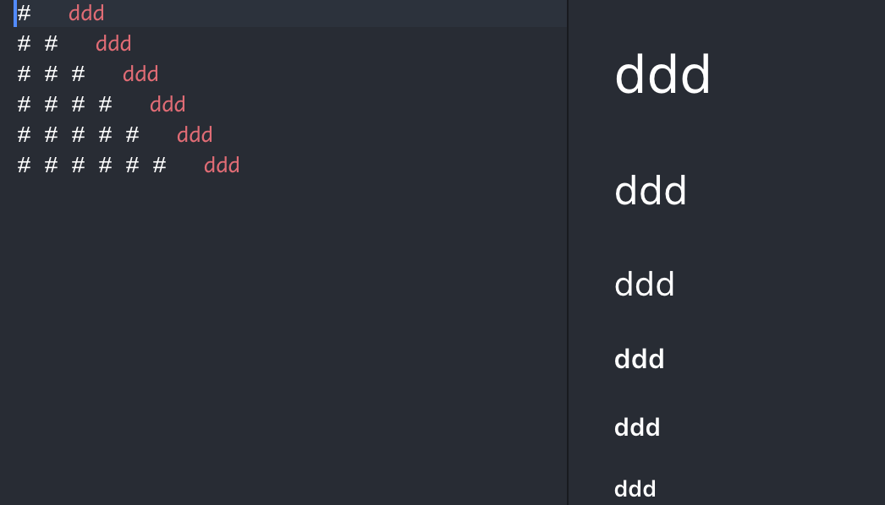  
#### Insert Picture
* 行内式  
``
* 参考式  
`![Alt text][id]`  
`[id]: url/to/image "optional title attribute"`
* 插入照片的时候一定要注意路径  

>如何自定义插入图片的大小？  
>>由于markdown本身不支持图片修改，可以采用以下两种方式：
 * 嵌入html代码  
``  
 * 找一个支持参数的图床  
  1. 参照 [简书的简化贴图流程](http://www.jianshu.com/p/7bd4e6ed99be)  
  2. 利用github存储图片，在markdown引用图片链接地址，如下图所示（参照知乎用户）：  
 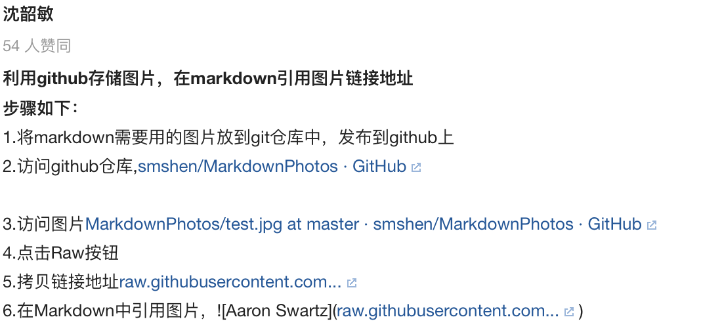  
  3. ......  

#### Blockquote
* 在每行的最前面加上 `>` ，markdown也允许你偷懒只在整个段落的第一行最前面加上 `>`
* 区块引用可以嵌套，只要加上不同数量的 `>`
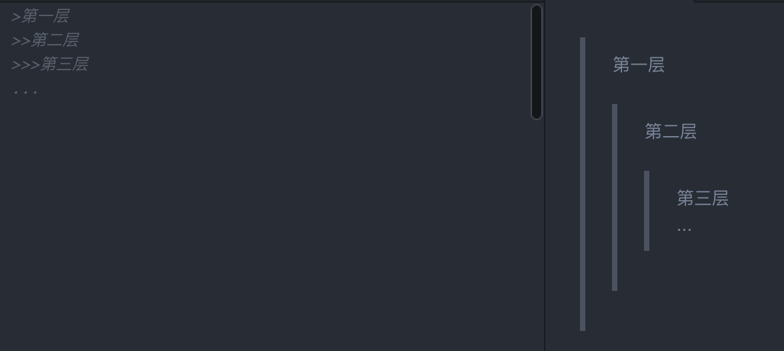

>* 引用的区块也可以使用其他的markdown语法，包括标题、列表、代码区块等  
* 引用列表时需注意，需要按情况自行添加空格来调整格式
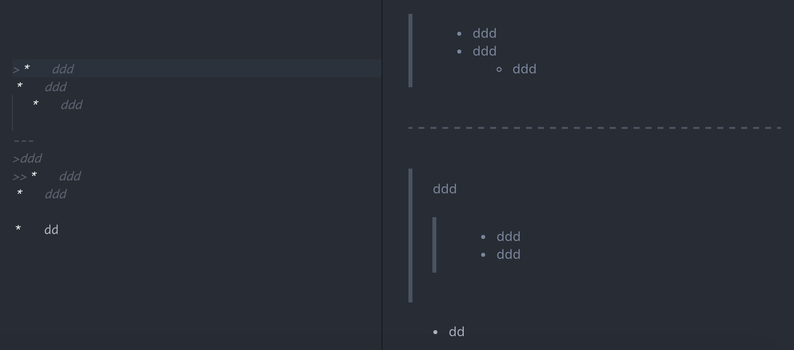

#### List
* 无序列表  
使用 `*` `+` `-` 加上 `space` 作为列表标记
* 有序列表  
使用数字加一个英文句点再加上 `space`

>如果你想要在有序列表下放一个无序列表，那么需在第二行无序列表开头加上空格:
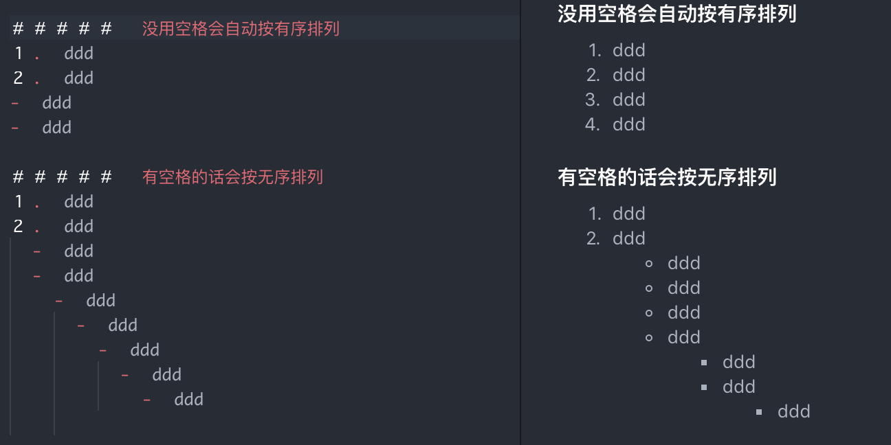

#### Code Block
* 很简单，首行缩进四个空格即可   

>如果你尝试发现没能显示代码区块，很可能是没有退出先前的格式，那就得按几次回车调整  
>>* 一句话结束后空至少两格后再回车，即可换行   
* 一段话结束后按两次回车即可退出先前的格式    

* 当然，你也可以用html `<pre><code> 代码区块 </code></pre>` 来描述  

            example: 开头空四格显示代码区块
<pre><code> example: 用html来写代码区块 </code></pre>  
>一个代码区块会一直持续到没有缩进的那一行

#### Devider line
在一行中用三个以上的 `*` `-` `_` 来建立一个分隔线，行内不能有其他东西  
当然，你可以在`*` `-` `_` 中插入空格  
#### Link
不管是哪种语法，链名称都用方括号 `[...]` 来标记
* 行内式  
`[...](http://..../ "链接的title")`  

>* 圆括号必须紧跟在方括号后面  
* 双引号中的内容是可选的

* 参考式  
`[...] [id]`  
`[id]: http://..../ "optional title here"`   

>* [id]里面的内容可以是空的，采用链接名称 `[...]` 定义链接，如下图所示：
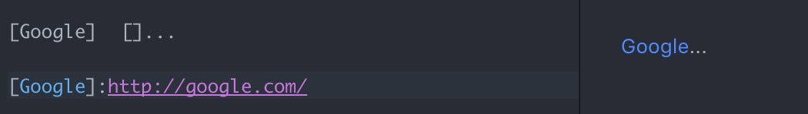  
* 你可以选择性地在两个方括号之间加上空格    
* 双引号中的内容是可选的  

>>如何在列表中的引用里插入列表？    

>>>关键在于要按情况自行添加空格：
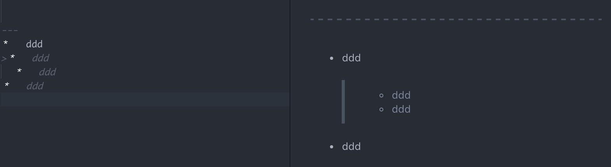

#### Emphasis
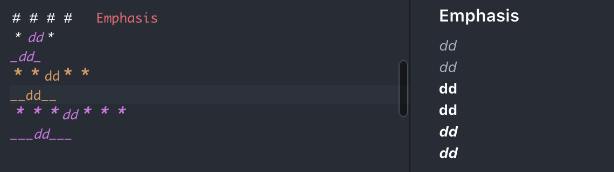
#### Code Span
使用 `` ` `` 反引号（tab键上方）把代码标记起来
>* 如果要在代码区段内插入反引号，需使用多个反引号来开启和结束这段代码  
为了清晰起见，可以自行添加空格  
* 如果有一整块代码需要包围，可以使用3个 `` ` `` 来标记   

>>起始端后面和结束端前面加一个空格，就可以在区段的一开始插入反引号：
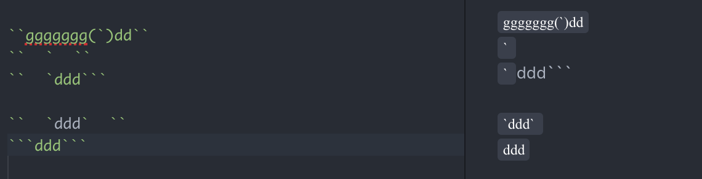  
注意加空格前后的区别

#### Line Through
使用 `~~......~~` 增加删除线  
`~~mistaken text~~` 的渲染效果：~~mistaken text~~
#### Syntax Highlighting
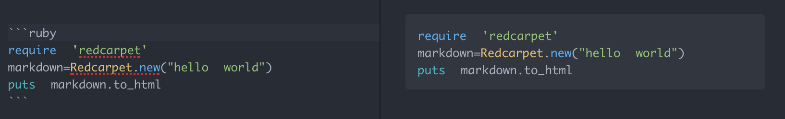
#### Table
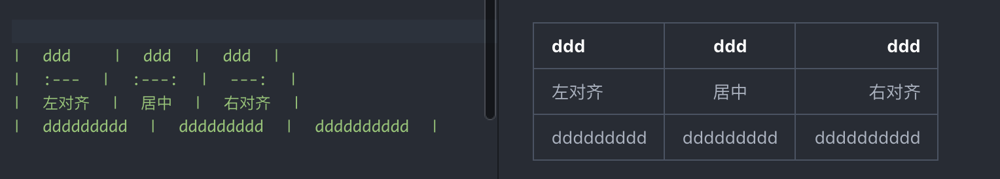
#### Reference
[atom 中文使用手册](https://atom-china.org/t/atom/62)  
[atom 官网手册](https://atom.io/docs/)  
[markdown 语法手册](http://wowubuntu.com/markdown/index.html)
