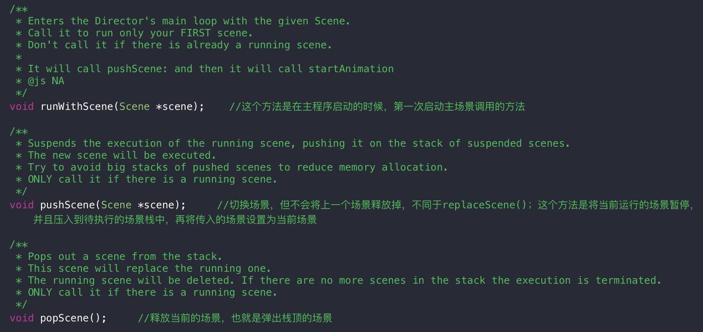
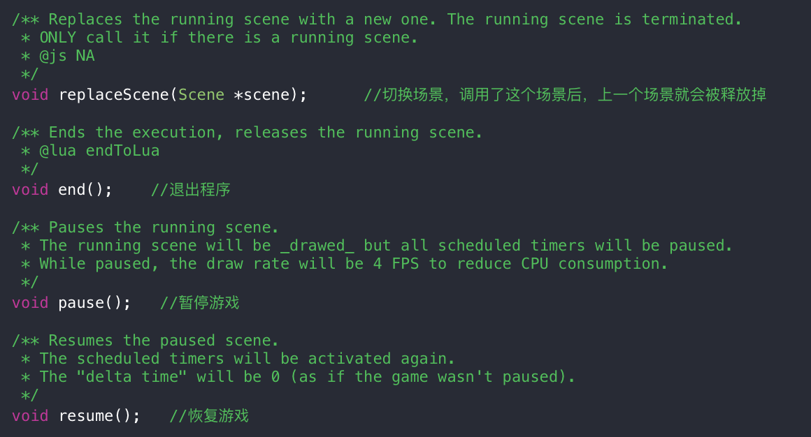
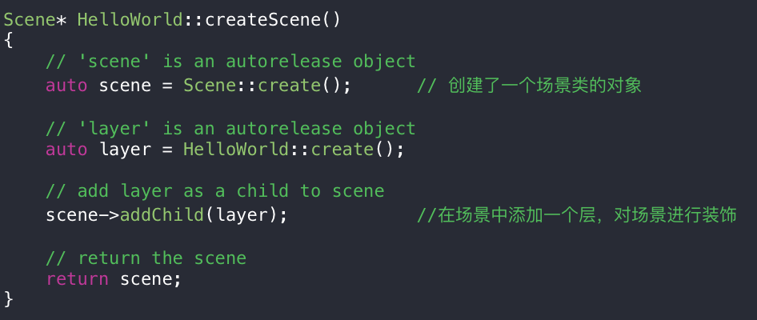
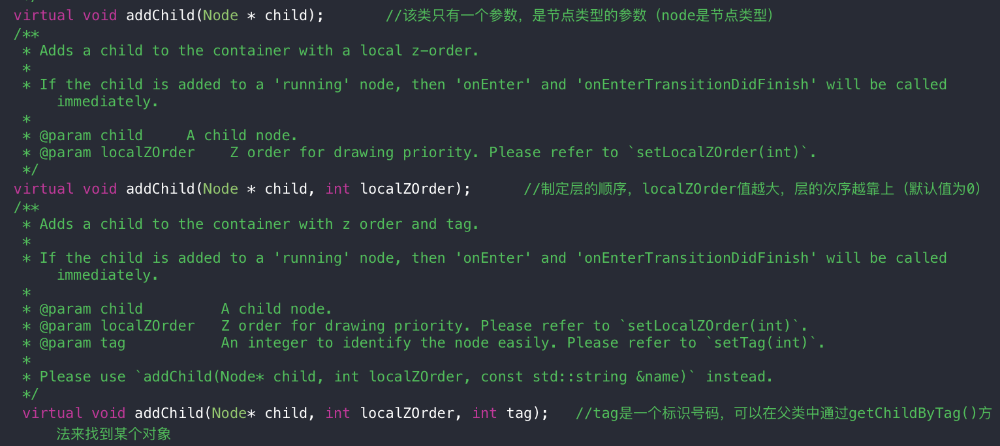

### Cocos2d-x Introduction  
> 游戏引擎相当于游戏开发的框架：   
* 界面编辑器（UI）   
* 渲染系统（画面）
* 人机交互系统（键盘控制动作）  
* 动画系统  
* 音频系统  
* 物理引擎（碰撞检测）  
* 网络接口  
* ...  

* 引擎特点    
 * 开源  
 * 跨平台（基于OpenGL | ES图形库）  

 > Cocos2d-x是基于c++的，该跨平台特性不同于java、flash（一次编译到处运行）；c++、c是一次编码到处编译的  

 * 多种开发语言  
 * 不再仅仅是2D  

* 下载链接  
[cocos官网](http://www.cocos.com)  
* 安装教程
[Cocos2d-x游戏开发初体验-C++篇](http://www.imooc.com/learn/400)  
[Cocos2d-x基础教程二-会动的时钟](http://www.imooc.com/learn/551)  
示范：  
   

* Director类    
常见的API：runWithScene、pushScene、popScene、replaceScene、getVisibleSize、getWinSize、end、pause、resume  
  
  
  
> [官方API文档](http://api.cocos.com/cn/index.html)  

* Scene类    
场景就相当于一个层的容器，是一个抽象的概念  
一个场景中可以有很多个层，也可以只包含一个层   
  
* Layer类  
层也是一种容器，但和场景不一样  
 * create()方法的原理：利用宏函数 CREATE_FUNC  
   
 * addchild()方法：是node类里的方法  
     
 其中的三个函数解析：  
   

* Sprite类  
> 精灵类是对纹理的一种展示；纹理是物体表面的图案，简而言之纹理就是一张图片  
精灵类的作用：对纹理进行装载，对纹理进行各种操作   
原理：精灵原本是一张图片，加载后通过OpenGL绘制一个矩形，然后在矩形的表面对.png图片进行解析，将图片每个像素点的rgba（）信息映射到矩形上，这样纹理就显示在我们眼前了   

 * 精灵类的创建  
  使用Sprite类里的工程方法create进行创建，调用的create里包含了一个字符串型的参数；  
  这个参数表述精灵使用的纹理的文件名  
  Sprite类会自动将纹理作为图片载入到游戏中，然后使用纹理来初始化精灵  
  ```ruby  
  Sprite* Sprite::create(const std::string& filename, const Rect& rect){
    ...  
  }  
  ```  
  以上函数的 `Rect& rect` 参数可以让精灵只显示一部分纹理  
    

* Node类  
精灵类、场景累、层都继承于Node节点类；可以说游戏类里的元素都继承于Node类  
